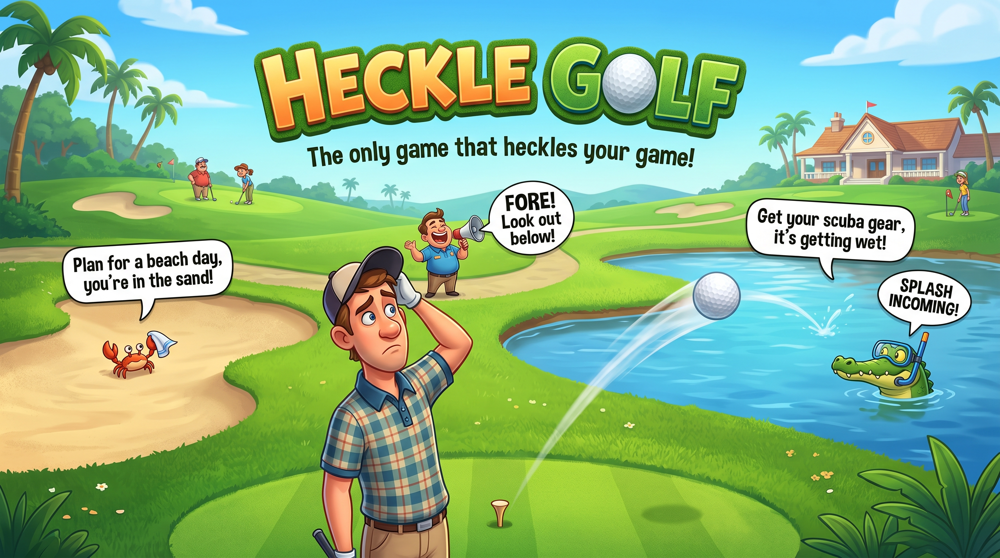
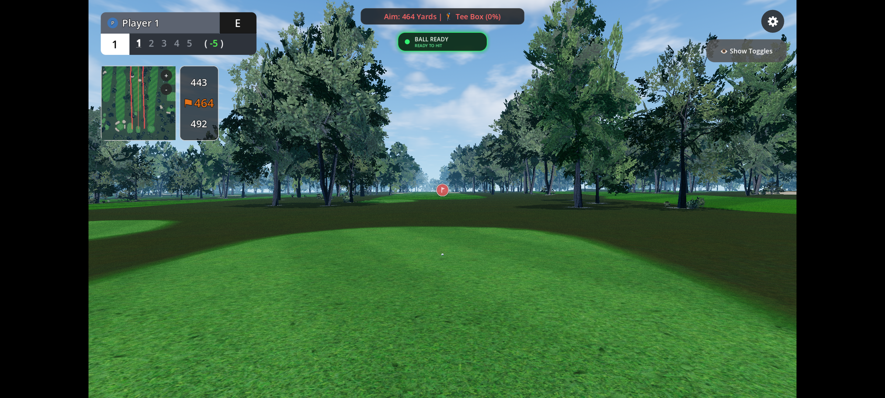
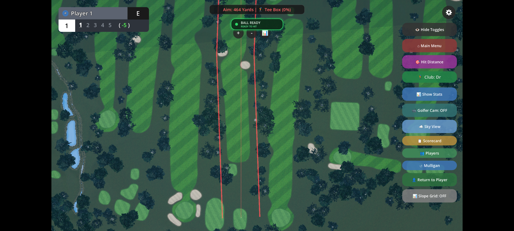
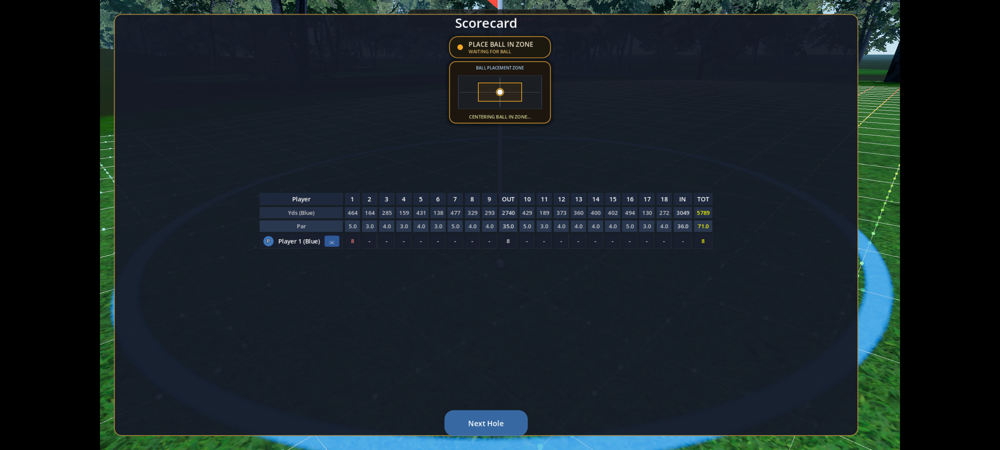
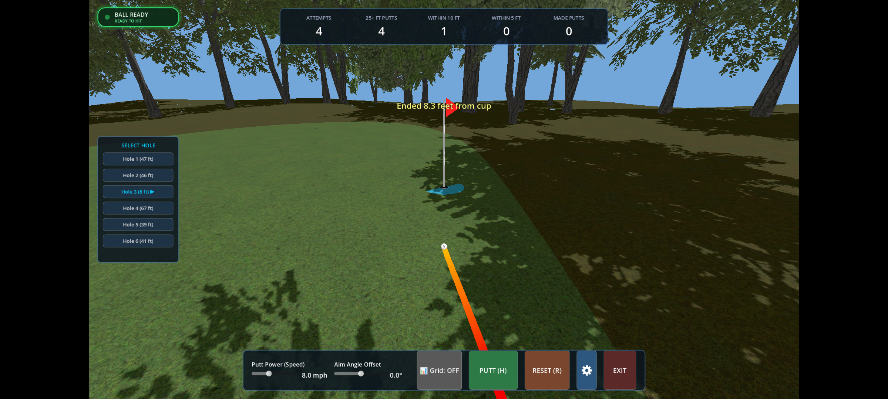
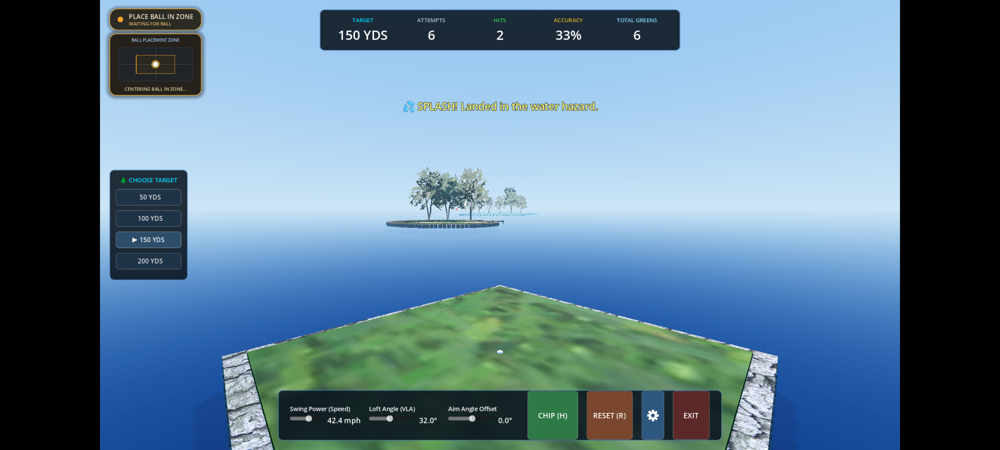
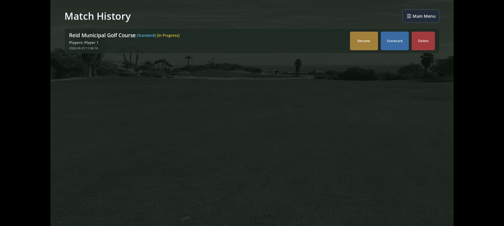
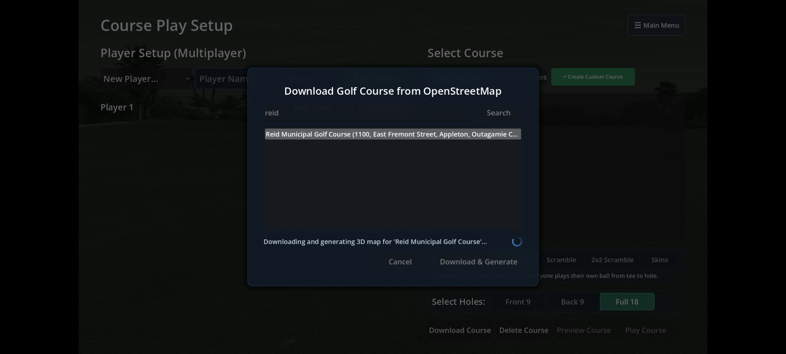

# Heckle Golf Simulator


An open-source, full-featured golf simulator and practice suite built with the Godot Engine (C# / .NET) using JoltPhysics3D and OpenFairway aerodynamics. 

**Heckle Golf Simulator** (formerly Open Shot Golf / JaySimG) delivers real-time launch monitor integration (Square, PiTrac, GSPro Open Connect v1), full 18-hole multiplayer course play, worldwide OpenStreetMap real course generation, custom course editing, putting and chipping minigames, dynamic heckle audio commentary, and AI golfer swing pose analysis via MediaPipe.

---

## Table of Contents
- [Overview](#overview)
- [Key Features & Game Modes](#key-features--game-modes)
  - [1. Driving Range & Telemetry](#1-driving-range--telemetry)
  - [2. Full Course Play & Multiplayer](#2-full-course-play--multiplayer)
  - [3. Minigames](#3-minigames)
  - [4. On-Course Practice Mode](#4-on-course-practice-mode)
  - [5. History, Session Logs & Shot Dispersion](#5-history-session-logs--shot-dispersion)
  - [6. Player Management & Profiles](#6-player-management--profiles)
  - [7. Achievements & Gamification](#7-achievements--gamification)
- [Course Generation & Creator](#course-generation--creator)
  - [OpenStreetMap (OSM) Real-World Course Importer](#openstreetmap-osm-real-world-course-importer)
  - [In-Game Custom Course Creator](#in-game-custom-course-creator)
  - [Course Loading & Discovery Architecture](#course-loading--discovery-architecture)
- [Dynamic Commentary & Heckle Announcer Engine](#dynamic-commentary--heckle-announcer-engine)
- [AI Golfer Camera & MediaPipe Pose Tracking](#ai-golfer-camera--mediapipe-pose-tracking)
- [Ball Physics & Aerodynamics](#ball-physics--aerodynamics)
  - [Reynolds Number Aerodynamic Modeling](#reynolds-number-aerodynamic-modeling)
  - [Turf Interaction & Rollout Tuning](#turf-interaction--rollout-tuning)
- [Hardware & Launch Monitor Connectivity](#hardware--launch-monitor-connectivity)
  - [Square Launch Monitor (Direct BLE / Serial / TCP)](#square-launch-monitor-direct-ble--serial--tcp)
  - [GSPro Open Connect v1 TCP Listener](#gspro-open-connect-v1-tcp-listener)
  - [Data Sequence Diagram](#data-sequence-diagram)
  - [Sample Data Payload](#sample-data-payload)
  - [Testing & Shot Injection Utilities](#testing--shot-injection-utilities)
- [Build and Run](#build-and-run)
  - [Prerequisites](#prerequisites)
  - [Clone & Import](#clone--import)
  - [Running the Project](#running-the-project)
  - [Android Wireless Debugging](#android-wireless-debugging)
  - [Android MediaPipe Pose Plugin Rebuild](#android-mediapipe-pose-plugin-rebuild)
- [Controls](#controls)
- [Project Architecture & Directory Layout](#project-architecture--directory-layout)

---

## Overview
Heckle Golf Simulator is designed to provide an open, hackable, and expandable golf simulation environment running natively on Windows, Linux, and Android. It pairs directly with launch monitors (such as the Square Golf Launch Monitor and PiTrac) or with any hardware that transmits GSPro Open Connect v1 JSON packets over TCP.

Whether you want to dial in your yardages on the range, play an 18-hole match against friends on real-world golf courses downloaded straight from satellite open data, work on your short game with break-reading putting minigames, or have a witty announcer roast your slices, Heckle Golf Simulator has you covered.

---

## Key Features & Game Modes

### 1. Driving Range & Telemetry
- **Full On-Screen Telemetry HUD**: Real-time readouts for Carry Distance, Total Distance, Ball Speed, Club Speed, Smash Factor, Launch Angles (Vertical Launch Angle / Horizontal Launch Angle), Total Spin, Backspin, Sidespin, Spin Axis, Apex Height, and Offline yards.
- **Dynamic Shot Trails & Dispersion Ellipses**: 3D ribbon trails rendered in real time, with color-coded dispersion groupings mapped by club type.
- **Target Greens & Distance Markers**: Multiple target greens and flags across realistic range distances with yardage markers.
- **Environmental Simulation**: Real-time atmospheric controls for Altitude, Temperature, Humidity, and Wind speed/direction, adjusting air density and ball drag on the fly.
- **Surface Presets**: Configurable turf conditions (Firm, Fairway, Soft Fairway, Rough) adjusting ground friction and rollout.

### 2. Full Course Play & Multiplayer
- **Complete Round Simulation**: Support for 9-hole and 18-hole rounds across built-in, imported, or user-created golf courses.
- **Multiple Game Formats**: Stroke Play, Match Play, and Skins game modes.
- **USGA Rules of Play**: Automated turn management with "away player hits first" and honors rotation based on lowest previous-hole scores.
- **Overhead GPS Minimap**: Real-time top-down course overview displaying tee boxes, fairways, hazards, ball positions, and pin locations, with automated green zoom when on the putting surface.
- **Distance to Pin HUD**: Dynamic calculation showing distances to the Front, Middle, and Back of the green.
- **Full Scorecard & Mulligan Support**: Interactive in-game scorecard overlay and optional mulligan allowances for casual play.


*Course Play: 3D tee box view with real-time distance HUD, ball status, and GPS minimap.*


*Course Play: Top-down GPS overview displaying hole layout, shot aim trajectory corridor, and quick toggles.*


*Full 18-hole scorecard overlay with par, yardage breakdown, and live scoring.*

### 3. Minigames
- **Putting Practice**:
  - Procedurally generated, undulating putting green featuring realistic ridges, slopes, and break lines.
  - Interactive 3D Orbit Camera (Right-click drag, keyboard A/D or arrow keys, and UI aim slider) to read break contours from any vantage point.
  - Floating target selection panel with quick-switch targets (Holes 1–5).
  - Accurate cup entry snap and drop physics with authentic golf cup sound effects.


*Putting Practice: Break-reading, target cup selection, power/aim offset sliders, and accuracy tracking.*

- **Chipping Practice**:
  - Staggered island targets spaced across 25, 50, 75, 100, 125, 150, and 200 yards surrounded by water.
  - Authentic multi-tier island construction with wooden retaining wall bulkheads and turf tops.
  - Staggered layout requiring precise horizontal aim (HLA) and trajectory control.
  - Dynamic follow-camera tracking ball flight and splash/rest states.


*Chipping Practice: Multi-distance island targets over water with launch speed and loft controls.*

### 4. On-Course Practice Mode
- Select any hole on any course to practice specific shots repeatedly without advancing scores.
- Free ball placement and instant reset options for dialing in approach shots or trouble escapes.

### 5. History, Session Logs & Shot Dispersion
- **Session Recorder**: Automatically saves all hit data, shot vectors, and club selections.
- **Shot Playback & Review**: Revisit prior sessions, inspect individual shot statistics, and review club distance averages and dispersion groupings.
- **Match History & Resumption**: Resume in-progress 9 or 18-hole rounds or review previous match scorecards.


*Match History: Manage saved rounds, inspect scorecards, or resume in-progress matches.*

### 6. Player Management & Profiles
- Manage multiple golfers with custom player names, handicaps, preferred tee boxes, and distinct player color tags for minimap and HUD identification.

### 7. Achievements & Gamification
- Integrated `AchievementManager` system that monitors shot metrics in real time.
- On-screen popups celebrating milestones such as 300+ yard drives, holes-in-one, pin-seeking approaches, and consecutive greens in regulation.

---

## Course Generation & Creator

### OpenStreetMap (OSM) Real-World Course Importer
`Courses/OsmMapLoader.cs` and the in-game Download Dialog allow you to search and download **any golf course in the world** directly into the game:
- **Global Search**: Queries OpenStreetMap Overpass API endpoints for `leisure=golf_course`, `golf=fairway`, `golf=green`, `golf=bunker`, `golf=tee`, and `golf=hole`.
- **Elevation Integration**: Downloads digital terrain elevation models to generate realistic 3D topography, rolling hills, and elevation changes.
- **3D Procedural Mesh Generation**: Generates 3D polygonal meshes (`ArrayMesh`) for each surface with collision shapes and surface physics tags (`"surface_type"`).
- **Automated Caching**: Courses are compiled into Godot `PackedScene` files (`user://courses/{course_name}/course.tscn`) with structured metadata (`course.json`) for instantaneous loading on subsequent playthroughs.


*OpenStreetMap Downloader: Search real-world golf courses worldwide and procedurally generate 3D course layouts.*

### In-Game Custom Course Creator
- Use the built-in Custom Course Creator (`UI/CustomCourseCreator/`) to layout your own golf holes.
- Plot tee boxes, fairway boundaries, green perimeters, and hazard locations with interactive vector tools.

### Course Loading & Discovery Architecture

- `CourseValidator` validates each course directory upon discovery (verifying `course.json`, title, par configuration, and scene integrity).
- `CourseList` indexes validated courses into UI metadata for fast, responsive selection.
- `CourseManager` instantiates and manages course transitions through `SceneManager`.

---

## Dynamic Commentary & Heckle Announcer Engine
The announcer engine (`addons/announcer/AnnouncerEngine.cs`) brings personality and humor to every round:
- **Smart Context Detection**: Analyzes ball telemetry in real time to categorize shots:
  - **Slices & Hooks**: Humorous commentary on sharp curves and migrating balls.
  - **Crushed Drives / Bombs**: Praise for flushed shots traveling over 270+ yards.
  - **Bunkers & Kitty Litter**: Beach roasts when landing in sand traps.
  - **Wormburners & Skyballs**: Roasts for low skimmers (< 4° launch) or sky-high popups.
  - **Duffs & Topped Shots**: Witty remarks for shots under 20 yards.
  - **Idle Banter**: Quips if the golfer takes too long between swings (45-second timer).
- **Text-to-Speech (TTS) Integration**: Utilizes native platform TTS engines (Godot `DisplayServer.TtsSpeak` and `AndroidTTS.cs`).
- **Customizable**: Adjust pitch, rate, speech voice, and independently toggle praise or heckles in the Settings menu.

---

## AI Golfer Camera & MediaPipe Pose Tracking
Heckle Golf Simulator includes a real-time swing analysis and golfer pose estimation system (`UI/GolferCamera/`):
- **Native Android MediaPipe GPU Plugin**: Powered by `MediaPipePosePlugin.aar`, utilizing MediaPipe Pose Landmarker Lite running directly on the Android GPU.
- **Live 33-Point Skeletal Landmark Overlay**: Displays full-body skeletal tracking over the golfer's live camera feed.
- **Real-Time Swing Telemetry**:
  - Swing tempo and backswing-to-downswing timing ratio (e.g., 3:1 tempo).
  - Spine angle maintenance throughout the swing.
  - Shoulder turn and hip rotation angles.
  - Top-of-backswing (address), impact, and follow-through detection.
- **Swing Replay Modal**: Buffer and replay recorded swings with slow-motion scrub and frame-by-frame review.

---

## Ball Physics & Aerodynamics
Ball flight is powered by the **OpenFairway v1.0.6** physics system combined with Godot's **JoltPhysics3D** engine:
- Ball flight transitions through discrete states: `FLIGHT`, `ROLLOUT`, and `REST`.
- Horizontal distance is calculated in meters and converted to yards in UI readouts (`carry`, `total`, `apex`, `offline`).

### Reynolds Number Aerodynamic Modeling
Drag ($C_d$) and Lift ($C_l$) coefficients are calculated dynamically in `physics/aerodynamics.gd` based on Reynolds number ($Re$) and spin ratio ($S$):
$$Re = \frac{\rho \cdot v \cdot d}{\mu}$$
- **$Re < 50\text{k}$**: Low Reynolds regime (slow wedges and short chips under 77 mph) — constant $C_l = 0.1$.
- **$50\text{k} < Re < 75\text{k}$**: Polynomial transition interpolation between regime models.
- **$75\text{k} < Re < 200\text{k}$**: Linear model for normal golf shots (77–155 mph).
- **$Re > 200\text{k}$**: Clamped high-velocity aerodynamic regime (extreme long drive speeds).
- A Python validation script (`assets/scripts/reynolds_calculator.py`) is provided for aerodynamic model verification.

### Turf Interaction & Rollout Tuning
- Surface presets (Firm, Fairway, Soft Fairway, Rough, Sand, Green) dynamically apply kinetic friction ($\mu_k$), rolling resistance ($\mu_{kr}$), and grass drag ($\nu_g$) via `physics/surface.gd`.
- Informed by USGA Stimpmeter and turf friction literature:
  - [USGA Green Speed Physics (Deceleration on Greens)](https://www.waddengolfacademy.com/putting/USGA%20Green%20Speed%20Physics.pdf)
  - [Jenkins et al., “Drag Coefficients of Golf Balls” (World Journal of Mechanics 2018)](https://www.scirp.org/pdf/WJM_2018062515520887.pdf)
  - [USGA Stimpmeter Measuring Guide](https://www.usga.org/content/dam/usga/pdf/imported/StimpmeterBookletFINAL.pdf)

---

## Hardware & Launch Monitor Connectivity

### Square Launch Monitor (Direct BLE / Serial / TCP)
Full native support for the Square Golf Launch Monitor under `addons/launch_monitors/square/`:
- Connects directly via Bluetooth Low Energy (BLE), Serial Port, or TCP network socket.
- Decodes full binary protocol packets into Godot shot metrics (Ball Speed, Launch Angle, Direction, Total Spin, Spin Axis, Club Speed).
- Real-time device state events (`Connected`, `Ready`, `BallDetected`, `ShotReceived`, `Disconnected`).

### GSPro Open Connect v1 TCP Listener
A built-in C# TCP server (`addons/launch_monitors/common/tcp_server/TcpServer.cs`) listens on port **`49152`** for standard GSPro Open Connect v1 JSON packets. Any launch monitor bridge (PiTrac, Garmin, FlightScope, etc.) sending to port 49152 works seamlessly out of the box.

### Data Sequence Diagram


### Sample Data Payload
Example GSPro Open Connect v1 message used for socket testing (`assets/data/drive_test_shot.json`):
```json
{
    "DeviceID": "PiTrac LM 1.1",
    "Units": "Yards",
    "ShotNumber": 13,
    "APIversion": "1",
    "BallData" : {
        "Speed": 147.5,
        "SpinAxis": -13.2,
        "TotalSpin": 3250.0,
        "BackSpin": 2500.0,
        "SideSpin": -800.0,
        "HLA": 2.3,
        "VLA": 14.3,
        "CarryDistance": 256.5
    },
    "ClubData": {
        "Speed": 0.0,
        "AngleOfAttack": 0.0,
        "FaceToTarget": 0.0,
        "Lie": 0.0,
        "Loft": 0.0,
        "Path": 0.0,
        "SpeedAtImpact": 0.0,
        "VerticalFaceImpact": 0.0,
        "HorizontalFaceImpact": 0.0,
        "ClosureRate": 0.0
    },
    "ShotDataOptions": {
        "ContainsBallData": true,
        "ContainsClubData": false,
        "LaunchMonitorIsReady": true,
        "LaunchMonitorBallDetected": true,
        "IsHeartBeat": false
    }
}
```

### Testing & Shot Injection Utilities
- **In-Game Shot Injector**: Access the built-in injector UI (`UI/shot_injector.gd`) to test shots without physical hardware.
- **Python Shot Injector**: Run `python inject_shot.py` to send customizable test shot payloads to port 49152.
- **PowerShell Script**: Run `.\inject_shot.ps1` for rapid Windows socket testing.

---

## Build and Run

### Prerequisites
1. **Godot Engine**: Download and install **Godot 4.6+ or 4.7 .NET (C#) edition**: https://godotengine.org/download
2. **.NET SDK**: Install **.NET SDK version 9.0 or later**: https://dotnet.microsoft.com/download

### Clone & Import
1. Clone the repository:
   ```bash
   git clone https://github.com/mmancl/HeckleGolfSim.git
   ```
2. Open the Godot Project Manager, click **Import**, select `project.godot` inside the repository directory, and confirm.
3. Build the C# solution inside Godot (click **Build** in the top right corner of the Godot editor).

### Running the Project
- Press **F5** or the Play button in Godot to run the main menu.
- If testing locally, use keyboard shortcut `H` to simulate a hit or `R` to reset the ball.

### Android Wireless Debugging
If you want to deploy and debug directly to an Android device over Wi-Fi, Godot requires you to pair and connect the device via ADB first:

1. Enable **Developer Options** and **Wireless debugging** on your Android device.
2. Tap "Wireless debugging" and select **Pair device with pairing code** to get your pairing IP, Port, and Code.
3. Open PowerShell/Command Prompt and run:
   ```bash
   adb pair <IP_ADDRESS>:<PORT>
   ```
   *Enter the pairing code when prompted. (Note: `adb` is typically located at `%LOCALAPPDATA%\Android\Sdk\platform-tools\adb.exe` on Windows).*
4. Go back to the main Wireless debugging screen to find the connection IP and Port (this port is different from the pairing port).
5. Connect to the device:
   ```bash
   adb connect <IP_ADDRESS>:<PORT>
   ```

### Android MediaPipe Pose Plugin Rebuild
To rebuild the native Android GPU MediaPipe pose detection plugin (`MediaPipePosePlugin.aar`):
1. Ensure the task model `pose_landmarker_lite.task` is located in `android/plugins/MediaPipePosePlugin/src/main/assets/`.
2. Run Gradle assemble:
   - **Windows:** `cd android\build && gradlew.bat -p ..\plugins\MediaPipePosePlugin assembleRelease`
   - **Linux/macOS:** `cd android/build && ./gradlew -p ../plugins/MediaPipePosePlugin assembleRelease`
3. Copy the output AAR to the plugin folder:
   - Copy `android/plugins/MediaPipePosePlugin/build/outputs/aar/MediaPipePosePlugin-release.aar` to `android/plugins/MediaPipePosePlugin/MediaPipePosePlugin.aar`.
    - Verify the copied `.aar` is **~5 MB** in size (containing the bundled MediaPipe ML model).

---

## Controls
| Action | Key / Input | Context |
| :--- | :--- | :--- |
| **Simulate Hit** | `H` | Range, Course Play, Minigames |
| **Reset Ball** | `R` | Range, Course Play, Minigames |
| **Orbit Aim / Look Around** | **Right-Click Drag** | Putting & Chipping Minigames |
| **Rotate Aim Yaw** | `A` / `D` or **Left / Right Arrows** | Putting & Chipping Minigames |
| **Select Target** | **Click Left Target Panel** | Putting & Chipping Minigames |
| **Open Menu / Settings** | **Escape** or **UI Cog Button** | All Game Modes |

---

## Project Architecture & Directory Layout
```text
HeckleGolfSim/
├── addons/
│   ├── announcer/             # Heckle announcer C# engine & Android TTS bindings
│   ├── launch_monitors/       # Square LM, GSPro TCP server, and LM manager
│   ├── openfairway/           # OpenFairway realistic ball aerodynamics physics
│   ├── phantom_camera/        # Dynamic cinematic & follow camera system
│   ├── sky_3d/ & terrain_3d/  # Realistic sky, lighting, and terrain rendering
├── android/                   # Android build templates & native MediaPipe plugin
├── assets/                    # Textures, UI artwork, sample shot data, test scripts
├── Courses/
│   ├── CoursePlay/            # Multi-hole course play, HUD, minimap, rules
│   ├── CourseSelector/        # Course picker, validation, and preview
│   ├── Minigames/             # Putting Practice & Chipping Practice minigames
│   ├── OsmMapLoader.cs        # OpenStreetMap global course downloader & 3D builder
│   ├── OsmDownloadDialog/     # In-game OSM search & download dialog
│   └── Range/                 # Driving range scene and target markers
├── Player/                    # Ball physics controller, telemetry calculations
├── physics/                   # Aerodynamics (Reynolds/spin ratio), surfaces, turf
├── UI/
│   ├── AchievementPopup/      # Milestone reward notifications
│   ├── ClubSelector/          # Club selection carousel & bag configuration
│   ├── CustomCourseCreator/   # Interactive custom course editor
│   ├── GolferCamera/          # MediaPipe skeleton overlay, swing analyzer & replay
│   ├── HistoryMenu/           # Historical shot data & session analytics
│   ├── MainMenu/              # Responsive card-based main menu
│   ├── MiniGamesMenu/         # Minigames hub selector
│   ├── PlayersMenu/           # Golfer profiles, handicaps, and colors
│   ├── Settings/              # Environmental, display, and LM configuration
│   └── theme/                 # Centralized UI design tokens and style rules
└── Utils/                     # SceneManager, MultiplayerManager, AchievementManager
```

## Community & Discord
Join the official **Heckle Golf Simulator Discord** to connect with fellow golfers, share feedback, request features, and get troubleshooting help:
- 💬 **Discord Server**: [https://discord.gg/gjaNhkQwJ](https://discord.gg/gjaNhkQwJ)
- 💡 **General Feedback**: Share impressions and tuning suggestions in `#feedback`.
- 🚀 **Feature Requests**: Propose new game modes, course tools, and device integrations in `#feature_requests`.
- 🐛 **Bug Reports**: Report issues with reproduction steps and screenshots in `#bug_reports`.

---

## License, Credits & Legal Disclaimers
- **Core Engine**: Built with [Godot Engine](https://godotengine.org/) (.NET C# / MIT License).
- **Open-Source Lineage**: Forked and evolved from [OpenShotGolf](https://github.com/jhauck2/OpenShotGolf) by jhauck2 (MIT License).
- **Ball Aerodynamics & Rollout**: Modeled with [OpenFairway](https://github.com/jesseincode/OpenFairway) (by Jesse Inman and Jakobi) and [Jolt Physics 3D](https://github.com/jrouwe/JoltPhysics) (by Jorrit Rouwe).
- **Golfer Pose AI**: Powered by [Google MediaPipe](https://developers.google.com/mediapipe) and TensorFlow.js (Apache 2.0).
- **Atmosphere & Skybox**: [Sky3D](https://github.com/CoryPetkovsek/godot-sky3d) by Cory Petkovsek & J. Cuéllar (MIT License). Milky Way panorama: *"The Milky Way panorama"* by ESO/S. Brunier under [CC BY 4.0](https://creativecommons.org/licenses/by/4.0/).
- **Terrain & Follow Cam**: [Terrain3D](https://github.com/CoryPetkovsek/godot-terrain3d) and [Phantom Camera](https://github.com/ramok/phantom-camera) (MIT License).
- **Course Geometries & Open Data**: Course layouts and vector geography © [OpenStreetMap contributors](https://www.openstreetmap.org/copyright) (ODbL 1.0); elevation data from USGS 3DEP and AWS Terrain Tiles.
- **PBR Textures & Models**: Materials from [ambientCG.com](https://ambientcg.com/) and Shapespark exterior plants under Creative Commons CC0 1.0 Universal (Public Domain).
- **Announcer Audio**: Original comedic commentary produced for Heckle Golf Sim as an artistic homage to classic PS2-era arcade golf games.
- **Hardware Non-Affiliation**: Heckle Golf Simulator is an independent open-source project and is **not affiliated with, endorsed by, or sponsored by Square Golf (SquareGolf Co., Ltd.), GSPro (FlightPath Golf LLC), Garmin Ltd., PiTrac, or any launch monitor manufacturer.** All trademarks are property of their respective owners and used under nominative fair use for technical compatibility.

For complete legal notices, safety warnings, and trademark terms, see [DISCLAIMER.md](DISCLAIMER.md).
